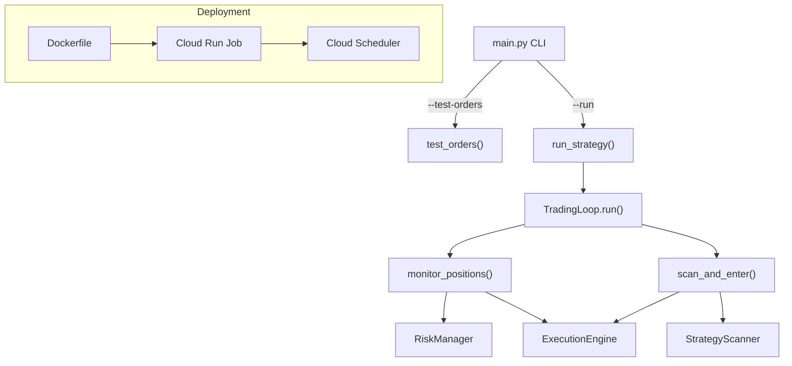

# Productionize CSP Strategy

## Architecture

The notebook code from all 3 phases gets extracted into a Python package under `live_trading/csp/`. The main entry point is a CLI (`main.py`) with two modes: `--test-orders` (order verification) and `--run` (full strategy loop).

**Recommended cloud service: Google Cloud Run Jobs.** The trading loop is polling-based (runs during market hours ~~6.5h/day), so a scheduled Cloud Run Job is ideal -- it starts before market open, runs the loop, and shuts down after close. You only pay for active hours (~~$2-5/month), unlike a VM running 24/7.




## Package Structure

```
live_trading/
  csp/
    __init__.py
    config.py           # StrategyConfig dataclass
    clients.py          # AlpacaClientManager
    data/
      __init__.py
      vix.py            # VixDataFetcher
      equity.py         # EquityDataFetcher
      options.py        # OptionsDataFetcher, GreeksCalculator
      models.py         # OptionContract, MarketSnapshot dataclasses
      manager.py        # DataManager
    signals/
      __init__.py
      indicators.py     # TechnicalIndicators
      equity_filter.py  # EquityFilter, EquityFilterResult
      options_filter.py # OptionsFilter, OptionsFilterResult
      scanner.py        # StrategyScanner, ScanResult
    trading/
      __init__.py
      models.py         # PositionStatus, ExitReason, ActivePosition, OrderResult, RiskCheckResult
      portfolio.py      # PortfolioManager
      risk.py           # RiskManager
      execution.py      # ExecutionEngine
      loop.py           # TradingLoop
    test_orders.py      # replenish_buying_power(), test_all_order_types()
    main.py             # CLI entry point
  Dockerfile
  requirements.txt
  .dockerignore
```

## Key implementation details

- `**config.py**`: Extract `StrategyConfig` from notebook. Add `paper_trading` and `log_level` fields. Load overrides from environment variables so Cloud Run can configure via env.
- `**main.py**`: Uses `argparse` with `--test-orders` (runs order type verification) and `--run` (runs the full trading loop). Both modes initialize the same client stack.
- `**test_orders.py**`: Contains `replenish_buying_power()` and `test_all_order_types()` ported from the notebook, using `ExecutionEngine` methods.
- **Logging**: Replace all `print()` with Python `logging` module. Structured logs for Cloud Run.
- `**requirements.txt**`: Pin versions for `alpaca-py`, `yfinance`, `pandas`, `numpy`, `py-vollib`, `python-dotenv`, `pytz`.
- **Dockerfile**: Python 3.12 slim base (3.14 not yet available in Docker images), install deps, copy package, `ENTRYPOINT ["python", "-m", "csp.main", "--run"]`.
- `**.dockerignore**`: Exclude notebooks, `.env`, `__pycache__`, `.git`.

## Cloud Run Job deployment

- **Cloud Scheduler** triggers the job at 9:25 AM ET (before market open) on weekdays
- **TradingLoop.run()** polls every `poll_interval_seconds` and exits after market close
- **Secrets**: `ALPACA_API_KEY` and `ALPACA_SECRET_KEY` stored in Google Secret Manager, mounted as env vars in Cloud Run
- Cloud Run Job has a max timeout of 24h, more than enough for a trading day

## Migration approach

Each module is a direct extraction from the notebook cells -- no logic changes, just organizing into files and replacing `print()` with `logging`. The notebook test cells become `test_orders.py`. The global instance creation (wiring up clients, fetchers, filters, scanner, execution engine, trading loop) moves into `main.py`.