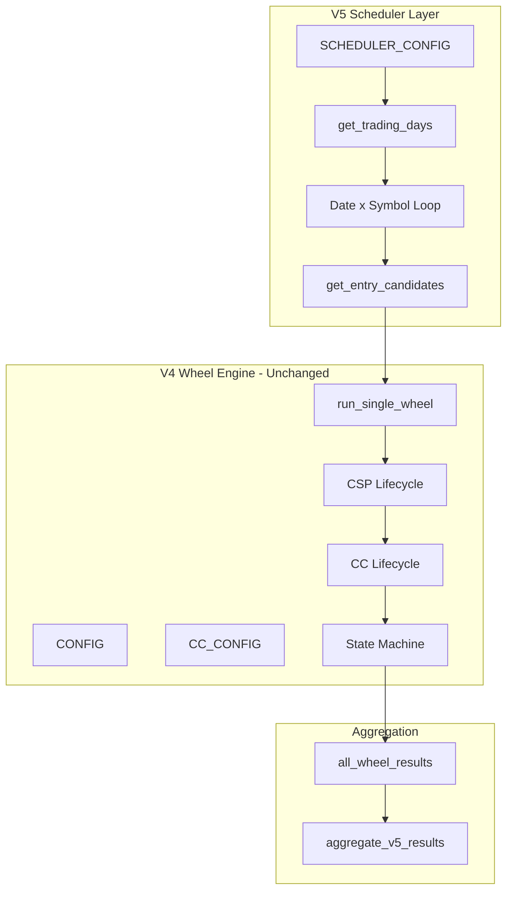

# Wheel Strategy v5 - Date Range + Multi-Ticker Scheduler

## Overview

Copy [`wheel_version_4_covered_call.ipynb`](notebooks/wheel_version_4_covered_call.ipynb) to a new `wheel_version_5_scheduler.ipynb` and add a scheduler layer that iterates over trading dates and symbols, launching wheel instances for each qualifying entry. The v4 wheel engine remains frozen - only orchestration changes.

## Architecture




## Implementation Steps

### Step 1: Create New Notebook

Copy the v4 notebook to `notebooks/wheel_version_5_scheduler.ipynb`. Update the header markdown to document v5 scope:> "v5 changes are limited to *wrappers + orchestration + aggregation*; strategy logic unchanged."

### Step 2: Add SCHEDULER_CONFIG

Add a new configuration block (before CONFIG and CC_CONFIG cells), ensure that configs do not conflict:

```python
SCHEDULER_CONFIG = {
    'start_date': '2022-01-01',
    'end_date': '2023-12-31',
    'trading_calendar': 'NYSE',
    'symbols': ['TSLA', 'AAPL', 'MSFT'],
    'allow_multiple_wheels_per_symbol': True,
    'max_wheels_per_symbol_per_day': None,
    'scheduler_seed': 123,
    'log_level': 'INFO',
}
```


### Step 3: Trading Calendar Utilities

Add helper using the already-imported `pandas_market_calendars`:

```python
def get_trading_days(start_date, end_date, calendar='NYSE'):
    cal = mcal.get_calendar(calendar)
    schedule = cal.schedule(start_date=start_date, end_date=end_date)
    return schedule.index
```

**Important:** `schedule.index` is timezone-naive; we treat it as a date (NY trading day). The `entry_time` timezone logic is applied separately when building `config_day['entry_date']`.

### Step 4: Entry Candidate Wrapper

Create `get_entry_candidates(symbol, trade_date, config)` that:

1. Fetches equity data for technical filter check
2. Fetches option chain snapshot at entry_time
3. Applies delta/DTE/liquidity filters
4. **Sorts candidates deterministically** by `['expiration', 'strike', 'symbol']` for reproducibility
5. Returns DataFrame of qualifying CSP candidates (no ranking, no capital constraints)
```python
# Deterministic ordering with stable tie-breaker prevents row-order variance
entry_candidates = entry_candidates.sort_values(
    ['expiration', 'strike', 'symbol']
).reset_index(drop=True)
```


This encapsulates existing cells 9-23 into a reusable function.

### Step 5: Single Wheel Wrapper

Create `run_single_wheel(candidate, config, cc_config, wheel_id)` that:

1. Calls existing `backtest_exit_strategy()` for CSP lifecycle
2. If assigned, calls existing `handle_assignment()`, `fetch_option_chain_for_cc()`, `select_covered_call()`, `backtest_covered_call()`
3. Calls `calculate_wheel_pnl()` to aggregate results
4. Returns standardized exit records with `wheel_id`, `phase`, `state` fields
5. **Stamps each result with `execution_version`** for downstream comparison

**Return type contract:** `run_single_wheel(...) -> List[dict]`

```python
# Add version metadata for result merging across v4/v5/v6
for record in wheel_results:
    record['execution_version'] = 'v5_scheduler'
return wheel_results  # List[dict]
```

This wraps existing cell 27 logic into a callable function.

### Step 6: Main Scheduler Loop

Create `run_v5_scheduler(CONFIG, CC_CONFIG, SCHEDULER_CONFIG)`:

```python
def run_v5_scheduler(CONFIG, CC_CONFIG, SCHEDULER_CONFIG):
    from copy import deepcopy
    all_wheel_results = []
    wheel_counter = 0
    log_info = SCHEDULER_CONFIG.get('log_level', 'INFO') == 'INFO'

    trading_days = get_trading_days(
        SCHEDULER_CONFIG['start_date'],
        SCHEDULER_CONFIG['end_date'],
        SCHEDULER_CONFIG['trading_calendar'],
    )

    for trade_date in trading_days:
        for symbol in SCHEDULER_CONFIG['symbols']:
            config_day = deepcopy(CONFIG)
            config_day['symbol'] = symbol
            config_day['entry_date'] = trade_date.strftime('%Y-%m-%d')

            entry_candidates = get_entry_candidates(symbol, trade_date, config_day)
            if len(entry_candidates) == 0:
                continue

            if log_info:
                print(f"[{trade_date.date()}] {symbol}: {len(entry_candidates)} candidates")

            for _, candidate in entry_candidates.iterrows():
                wheel_id = f"{symbol}_{trade_date.date()}_{wheel_counter}"
                wheel_counter += 1

                wheel_results = run_single_wheel(
                    candidate, config_day, CC_CONFIG, wheel_id
                )
                all_wheel_results.extend(wheel_results)

    if log_info:
        print(f"\nScheduler complete: {wheel_counter} wheels launched")

    # Handle empty results case (pd.concat([]) throws)
    if len(all_wheel_results) == 0:
        return pd.DataFrame()

    return pd.concat([pd.DataFrame([r]) for r in all_wheel_results], ignore_index=True)
```

**Logging Guard Pattern**: All print statements wrapped with `if log_info:`. Valid `log_level` values: `'INFO'` (default) or `'QUIET'`.**Note on `scheduler_seed`**: Reserved for v6 ranking/capital allocation; v5 is deterministic without it (determinism comes from trading calendar order + candidate sorting + execution_seed in wheel engine).

### Step 7: Aggregation Layer

Add read-only aggregation function:

```python
def aggregate_v5_results(df):
    totals = df[df['phase'] == 'total']
    return {
        'total_wheels': df['wheel_id'].nunique(),
        'total_pnl': totals['pnl'].sum(),
        'avg_wheel_roc': totals['wheel_roc'].mean(),
        'median_wheel_roc': totals['wheel_roc'].median(),
        'max_drawdown_proxy': totals['pnl'].min(),
    }
```


### Step 8: Data Model Assertions

Add validation cell to ensure data integrity:

```python
# Every wheel_id must have at least one phase
assert exits_df.groupby('wheel_id')['phase'].nunique().ge(1).all()

# Required fields present (includes execution_version for version tracking)
required_fields = ['wheel_id', 'symbol', 'entry_date', 'phase', 'state', 
                   'exit_reason', 'pnl', 'roc', 'execution_version']
assert all(col in exits_df.columns for col in required_fields)

# Verify execution version is consistent
assert (exits_df['execution_version'] == 'v5_scheduler').all()

# Ensure exactly one 'total' row per wheel_id (catches accidental duplicates)
totals = exits_df[exits_df['phase'] == 'total']
assert totals['wheel_id'].is_unique, "Duplicate 'total' rows detected for same wheel_id"
```


## Notebook Structure (Final)

1. **Imports** (existing)
2. **CONFIG** (existing - frozen)
3. **CC_CONFIG** (existing - frozen)
4. **SCHEDULER_CONFIG** (new)
5. **State Machine** (existing - frozen)
6. **Helper Functions** (existing - frozen)
7. **Trading Calendar Utilities** (new)
8. **Entry Candidate Selection** (new wrapper)
9. **Wheel Engine** (existing - frozen)